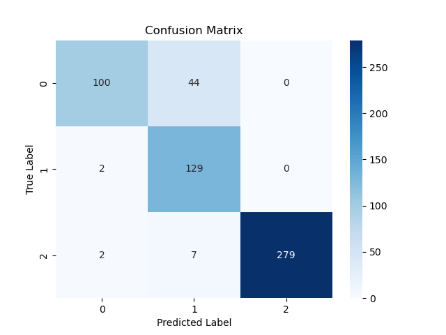

# Prediction of wing changes in the Lorenz63
Drawing inspiration from [E. Brugnago's paper](http://inaesp.org/PublicJG/brugnago_etal_predict_regime_change-durations_lorenz_CHAOS2020.pdf)
on regime changes in Lorenz's model, we trained an RNN to predict the number of time steps before the next wing change using the angles between the Lypunov covariant vectors. 

</br>

More precisely, if we denote $\theta_{ij}^{t}$ the angle between CLVs $i$ and $j$ at time $t$,
we trained the model to predict one of the following three categories using the matrix of angles between CLVs:

```math
\begin{equation}
    \Theta(t) = 
    \begin{pmatrix}
        \theta_{12}^{t-199} & \cdots & \cdots & \theta_{12}^{t}\\
        \theta_{13}^{t-199} & \cdots & \cdots & \theta_{13}^{t}\\
        \theta_{23}^{t-199} & \cdots & \cdots & \theta_{23}^{t}
    \end{pmatrix}
    \longrightarrow \left\{
    \begin{array}{ll}
        0: \text{next change in less than 50 time steps} \\
        1: \text{next change between 50 and 200 time steps} \\
        2: \text{next change in more then 200 time steps} 
    \end{array}
\right.
\end{equation}
```

## Installation
The environment can be copied using the following command
```console
conda env create --name ENVNAME --file environment.yml
```

## Results
Once the network has been trained, we obtain 97% accuracy on the validation data.
<p align="center">
  
</p>

So, given a matrix $\Theta(t)$, the network is able to provide information about the time before next change.
**The aim is to continue this work on intermittent chaotic systems in order to predict regime changes.**

## Visualisation
An example of the use of the trained network in parallel with the system dynamics can be seen executing `animation.py`,
or more simply by executing the following command:
```console
bash run.sh
```
